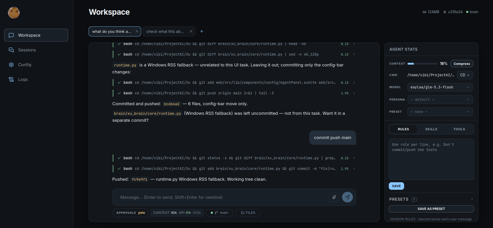
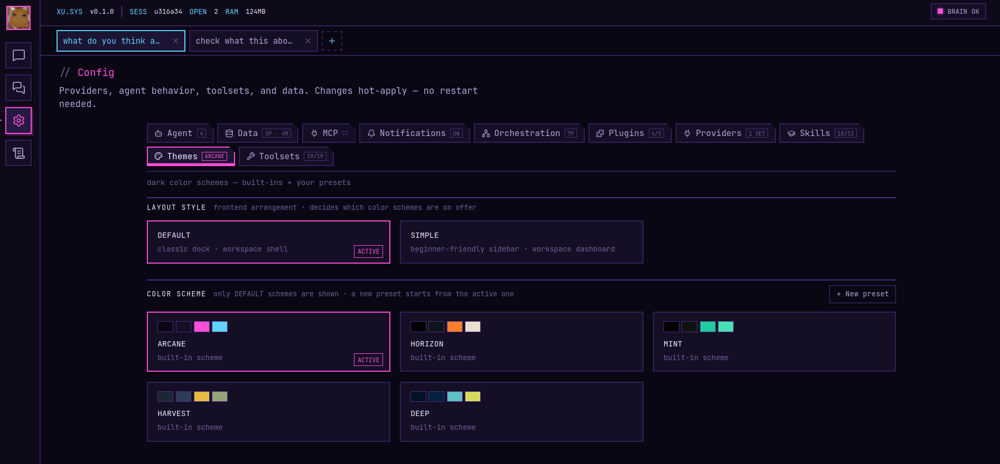

<div align="center">

# XU

### Personal AI Agent Harness

[](https://b2p.site)
[](https://python.org)
[](https://svelte.dev)

**Xu is a personal AI agent harness: a Python brain daemon that runs the agent loop, plus a Svelte 5 web shell — the only UX surface. One localhost WebSocket between the two. Simple and very basic.**

</div>

---





## Installation

Requirements: Python 3.12+, Git, and Node.js (npm) or bun — the launcher uses
npm/bun once to build the web UI on first start. [uv](https://docs.astral.sh/uv/)
is optional; the launcher falls back to stdlib `venv` + `pip` without it.

```bash
git clone https://github.com/vibicer/Xu-Harness.git
cd Xu-Harness
python xu.py start    # creates brain venv, builds web UI, opens http://localhost:1421
```

Other commands: `python xu.py stop | restart | status | logs | test | update` — `xu stop | restart | status | logs | test | update`


